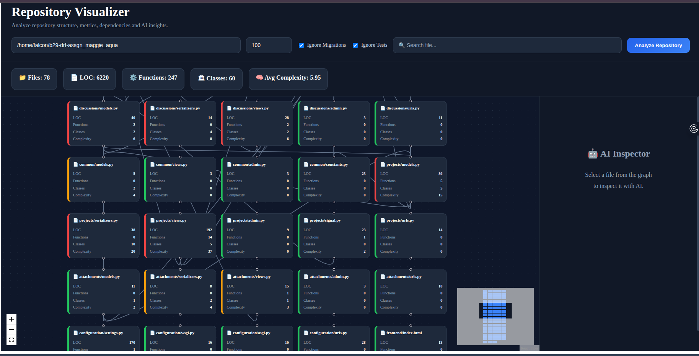
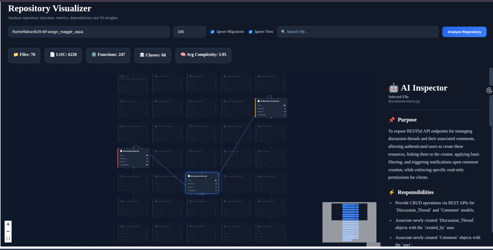
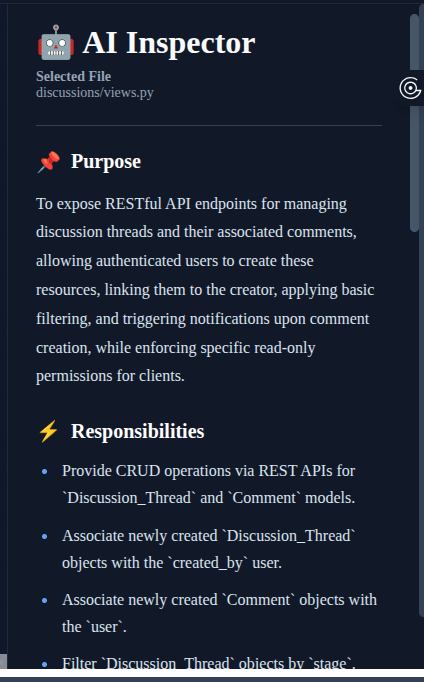
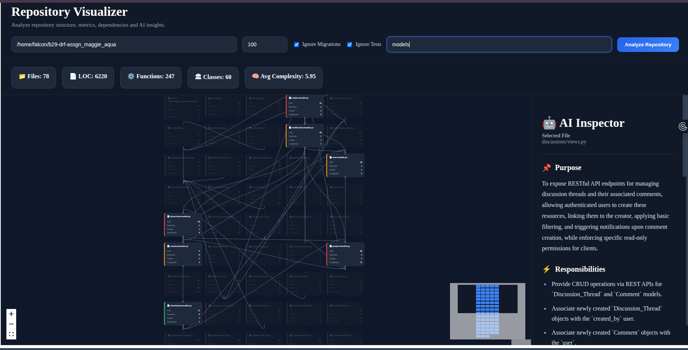
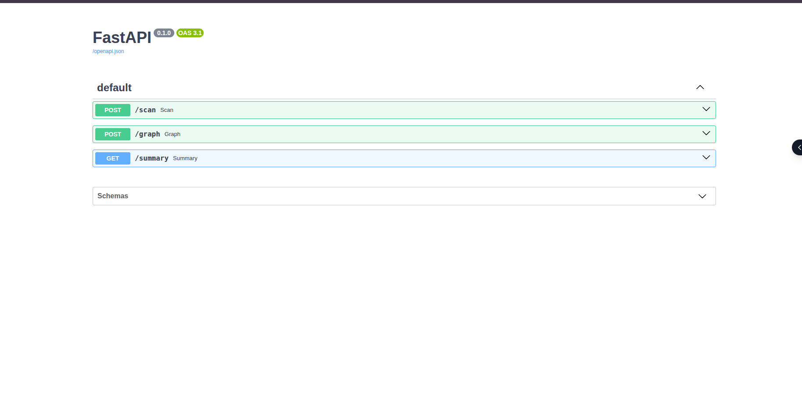

# gdsc-open-project-ps-3

## AI-Powered Repository Visualizer

RepoLens is an AI-powered repository visualization tool designed to help developers understand unfamiliar codebases through interactive dependency graphs, repository metrics, and AI-generated source code explanations.

The application performs static code analysis on a local repository, extracts dependencies between source files, computes code metrics, and leverages **Google Gemini AI** to generate structured explanations for individual files. By combining repository visualization with AI insights, RepoLens simplifies repository exploration and architecture understanding.

---

# 📷 Screenshots

## Dashboard



---

## Focus Mode



---

## AI Inspector



---

## Search



---

## API Documentation



---

# ✨ Key Highlights

- 🕸 Interactive dependency graph visualization
- 🤖 AI-powered code explanations using Google Gemini
- 🎯 Focus Mode for dependency exploration
- 🔍 Instant repository search
- 📈 Repository-wide code metrics
- 🎨 Complexity-based node coloring
- ⚡ Smart AI response caching
- 🌍 Multi-language repository scanning
- 🌙 Modern dark-themed responsive interface

---

# 🚀 Features

## Repository Analysis

- Recursive repository scanning
- Configurable maximum file limit
- Ignore migration files
- Ignore test files
- Multi-language repository scanning
- Repository statistics generation

---

## Interactive Dependency Graph

- Interactive graph visualization
- Dependency mapping between files
- Zoom, pan and minimap support
- Search functionality
- Focus Mode for dependency exploration
- Complexity-based node coloring

---

## AI Inspector

Generate AI explanations for any selected source file.

Each explanation contains:

- Purpose
- Responsibilities
- Important Functions / Classes
- Potential Improvements
- Estimated Complexity

Generated summaries are cached locally to reduce repeated API calls.

---

## Repository Metrics

Each source file includes:

- Lines of Code (LOC)
- Functions
- Classes
- Loops
- Branches
- Try Blocks
- Estimated Complexity

Repository overview includes:

- Total Files
- Total LOC
- Total Functions
- Total Classes
- Average Complexity

---

## Multi-language Support

Repository scanning currently supports:

- Python
- JavaScript
- TypeScript
- React
- Java
- C
- C++
- C#
- Go
- Rust
- PHP
- Kotlin
- Swift
- HTML
- CSS
- SQL
- Shell Scripts

> Dependency graph generation is currently implemented for Python repositories.

---

# ⚙️ Design & Implementation

## Repository Analysis

The backend recursively scans a repository while respecting user-defined options such as maximum file limit, ignored test files, and ignored migration files.

For every supported source file, the application extracts:

- File dependencies
- Code metrics
- Relative file paths
- Repository statistics

---

## Dependency Graph

Each source file is represented as a graph node.

Python import statements are analyzed using Python's Abstract Syntax Tree (AST) to construct directed edges representing dependencies between files.

The resulting graph is rendered interactively using **React Flow**.

---

## Complexity Score

RepoLens estimates implementation complexity using lightweight static code analysis.

For Python files, the complexity score is calculated as:

```text
Complexity =
Functions
+ (Classes × 2)
+ (Loops × 2)
+ Branches
+ Try Blocks
```

This heuristic provides a quick estimate of code complexity without requiring heavyweight static analysis tools.

---

## AI Inspector

When a file is selected, its contents are sent to **Google Gemini AI**.

Gemini returns a structured JSON response containing:

- Purpose
- Responsibilities
- Important Functions
- Suggested Improvements
- Estimated Complexity

---

## Smart AI Cache

To reduce API usage and improve response times, generated AI summaries are cached using a hash of the file contents.

If the same file is analyzed again without modification, the cached summary is returned instead of making another Gemini API request.

---

## Focus Mode

Selecting a node highlights only the selected file and its directly connected dependencies while fading unrelated nodes and edges.

This improves readability for repositories containing a large number of files.

---

# 🏗 Architecture

```text
                     User

                       │

                       ▼

               React Frontend

                       │
                REST API (Axios)

                       │

                       ▼

               FastAPI Backend

      ┌──────────────┼──────────────┐
      │              │              │
      ▼              ▼              ▼

 Repository      Metrics       AI Summary
   Scanner      Analyzer        (Gemini)

      │

      ▼

 Dependency Graph Builder

      │

      ▼

 React Flow Visualization
```

---

# 🛠 Tech Stack

## Frontend

- React
- React Flow
- Axios
- CSS

## Backend

- FastAPI
- Python
- AST
- Google Gemini AI

---

# 📁 Project Structure

```text
gdsc-open-project-ps-3/
│
├── backend/
│   ├── app/
│   │   ├── routes/
│   │   ├── services/
│   │   ├── utils/
│   │   ├── models/
│   │   └── main.py
│
├── frontend/
│   ├── src/
│   │   ├── api/
│   │   ├── adapters/
│   │   ├── components/
│   │   ├── pages/
│   │   └── styles/
│
├── screenshots/
│
└── README.md
```

---

# ⚙️ Prerequisites

- Python 3.11+
- Node.js 18+
- npm
- Google Gemini API Key

---

# 🚀 Installation

## Clone Repository

```bash
git clone <repository-url>

cd gdsc-open-project-ps-3
```

---

## Backend Setup

```bash
cd backend

python -m venv venv
```

Activate the virtual environment.

### Linux / macOS

```bash
source venv/bin/activate
```

### Windows

```bash
venv\Scripts\activate
```

Install dependencies.

```bash
pip install -r requirements.txt
```

Create a `.env` file.

```env
GEMINI_API_KEY=YOUR_API_KEY
```

Run the backend.

```bash
uvicorn app.main:app --reload
```

Backend:

```
http://127.0.0.1:8000
```

---

## Frontend Setup

```bash
cd frontend

npm install

npm run dev
```

Frontend:

```
http://localhost:5173
```

---

# ▶ Usage

1. Start the backend server.
2. Start the frontend.
3. Enter a local repository path.
4. Configure analysis options.
5. Click **Analyze Repository**.
6. Explore the dependency graph.
7. Search for files.
8. Click any node to activate **Focus Mode**.
9. View AI-generated explanations using the AI Inspector.

---

# 🔌 API Endpoints

### Analyze Repository

```
POST /graph
```

Returns:

- Repository graph
- Dependency edges
- Repository statistics

---

### Generate AI Summary

```
GET /summary
```

Returns an AI-generated explanation for the selected file.

---

# 📌 Assumptions

- The repository exists locally.
- Source files are readable.
- A valid Gemini API key is configured.
- Internet connectivity is available for AI summary generation.
- Dependency visualization is currently implemented for Python repositories.
- AI summaries are cached locally to reduce repeated API calls.

---

# 💡 Challenges Faced

- Accurately resolving dependencies between Python modules.
- Keeping repository graphs readable for larger projects.
- Integrating Gemini AI while handling API rate limits.
- Supporting repository scanning across multiple programming languages.

---

# 🚀 Future Improvements

- GitHub repository import
- Folder picker
- Dependency visualization for JavaScript and Java
- Folder-level graph visualization
- Export graph as PNG/PDF
- Circular dependency detection
- AI-generated repository architecture summary
- Code smell detection

---

# 👥 Team

**Team RepoLens**

- Falguni Dhingra
- Garvita Kothari

---

# 📄 License

This project was developed as part of the **(GDSC) Open Project (PS-3)** for educational purposes.